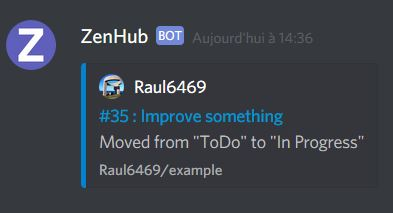

# ZenHub-Discord 

Get ZenHub notifications in your Discord channel

Currently supports issue transfers between pipelines only, contributions welcome!

## How to install

1. [Create a Discord webhook URL](https://support.discord.com/hc/en-us/articles/228383668-Intro-to-Webhooks)
2. Deploy this app on Heroku (a free dyno will do the job) by clicking the **Deploy to Heroku** button on top of this README, and provide your Discord webhook URL as part of the configuration
3. Go to your ZenHub organization settings, and create a custom integration, providing your newly deployed Heroku app URL as the webhook URL

